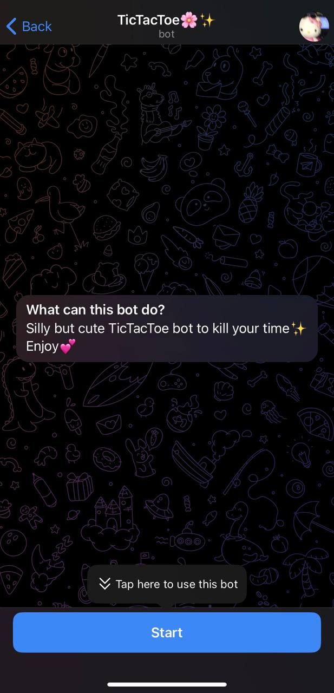

# Tic Tac Toe Telegram Bot

Welcome to the Tic Tac Toe Telegram Bot! This bot allows users to play the classic game of Tic Tac Toe directly within the Telegram messaging platform. Below is a brief overview of how the bot works and its key features.

## Overview

Unfortunately, due to limitations, the bot cannot be uploaded to a server. However, I've provided screenshots to demonstrate its functionality.

## Screenshots

Here are some screenshots showcasing the Tic Tac Toe Telegram Bot:

  This screenshot shows the initial description of the bot. Users need to press "Start" to activate the bot.

- { width=50% }

  After pressing `/start`, users receive a greeting message. They can start the game by pressing the "Start" button.

- { width=50% }

  The game board appears once the user starts the game. Users can select a cell to place their mark (heart).

- { width=50% }

  In win situations, the bot displays a victory message and image.

- { width=50% }

  In lose situations, the bot displays a defeat message and image.

- { width=50% }

  In tie situations, the bot displays a tie message and image.

- { width=50% }

  If the user presses an occupied cell, an error message is displayed.

## Usage

To use the Tic Tac Toe Telegram Bot, follow these steps:

1. Start the bot by pressing "Start".
2. Select a cell to place your mark.
3. Enjoy the game and have fun!

## Feedback

If you encounter any issues or have suggestions for improvement, feel free to contact me.
